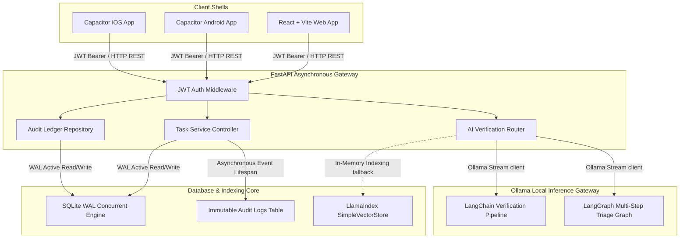
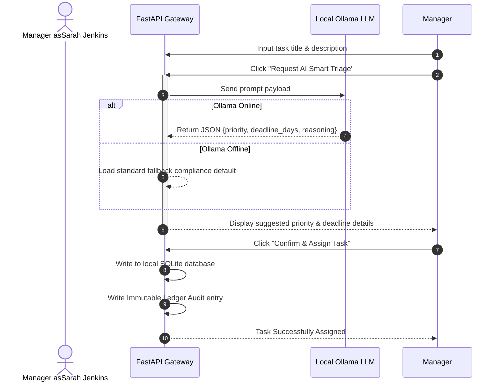
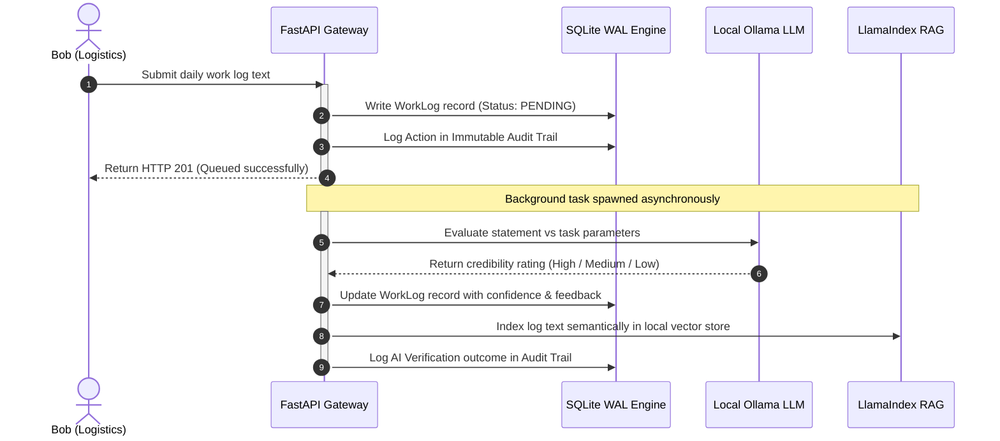

# WorkFlow ⚡ — AI-Powered Enterprise Workforce Accountability Platform

**WorkFlow** is a production-grade, full-stack compliance and task coordination suite that replaces scattered spreadsheets, chat threads, and verbal instruction with a single, verifiable source of truth. 

Featuring a highly concurrent **FastAPI async backend**, a **modern React + Vite web dashboard**, and a **Capacitor native mobile shell** for Android and iOS, WorkFlow enforces accountability through cryptographic timeline logging and real-time local LLM credibility audits.

---

## 🏗️ System Architecture & Telemetry Flow

The application coordinates services across four decoupled layers:



---

## 🛡️ Key Technical Innovations

1. **High-Concurrency SQLite WAL Listener:** By mapping database transactions through custom SQLAlchemy event listeners, the connection executes write pragmas (`journal_mode=WAL` and `synchronous=NORMAL`) dynamically on start. This unlocks multi-reader concurrency with asynchronous writes, resolving SQLite's single-writer locking constraints.
2. **Lifespan Background Overdue Daemon:** An asynchronous cron worker automatically spawns on backend boot, periodically auditing active tasks and transitioning past-deadline deliverables to the `OVERDUE` state without passive route dependencies.
3. **Self-Healing Local AI / RAG Fallback:** If local Ollama inference is offline, LlamaIndex automatically switches to an in-memory `SimpleVectorStore`, and routes seamlessly yield compliant fallback parameters, preventing HTTP 500 errors.
4. **Capacitor Native Mobile Shell:** Uses cross-platform bridges to synchronize Vite React bundles into ready-to-run Android Studio Gradle directories and iOS Apple Xcode projects.

---

## 🧬 Core Operational Workflows

### 1. Task Creation & AI Triage Workflow


### 2. Work Log Submission & Asynchronous AI Verification


---

## 🚀 Setup & Execution Guide

### 1. Configure the Asynchronous Backend
Initialize the virtual environment, sync packages, and start the gateway:
```bash
cd backend
uv sync

# Configure environment settings
cp .env.example .env

# Run the backend server (on conflict-free port 8005)
uv run uvicorn app.main:app --port 8005 --reload
```

### 2. Configure the React + Capacitor Frontend
Sync Vite assets and build cross-platform native iOS and Android folders:
```bash
# Install packages
npm install

# Compile Vite React app and sync assets to Android/iOS folders
npm run mobile:sync
```

### 3. Open Native iOS and Android Projects
Launch your platform-specific native IDEs instantly:
```bash
# Launch Xcode for Apple iOS compilation
npx cap open ios

# Launch Android Studio for Google Android compilation
npx cap open android
```

---

## 📊 Automated Multi-Role Simulation Suite
WorkFlow includes an advanced **user simulation script** that acts like a corporate manager and employee roster calling HTTP endpoints sequentially. 

To run the simulation and verify every single route, role permission, and ledger log:
```bash
cd backend
uv run python scripts/simulate_user.py
```

### What the Simulation Verifies:
1. **Sarah Jenkins** registers and logs in as the Manager.
2. **20 unique employee accounts** are registered across 8 diverse business departments.
3. **Role-Based Access Control (RBAC)** is validated: Employee attempts to assign tasks are rejected with a strict `403 Forbidden` response.
4. **15 custom tasks** are assigned across the roster (including overdue alerts).
5. Employees log in, pull their active dashboards, and submit progress logs with **AI Verification**.
6. Employees update task statuses (transitioning items to `COMPLETED` and `IN_PROGRESS`).
7. Sarah Jenkins pulls the dynamic plain-English briefing and **LangGraph agent recommendations**.
8. Fetches the complete audit trail, displaying **140 tamper-resistant history entries**!
